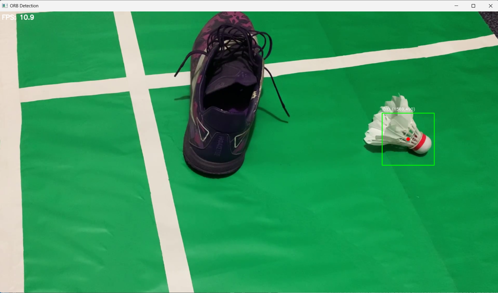
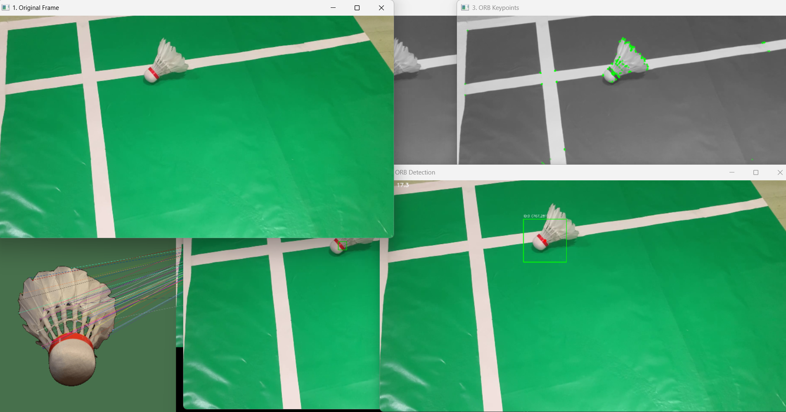

# Deteksi Shuttlecock Menggunakan Algoritma ORB

## 📌 Deskripsi Proyek
Proyek ini merupakan aplikasi **computer vision** untuk mendeteksi objek **shuttlecock (kok bulutangkis)** pada video menggunakan algoritma **ORB (Oriented FAST and Rotated BRIEF)**. Sistem bekerja dengan cara mengekstraksi fitur dari citra referensi shuttlecock, kemudian mencocokkannya dengan frame video input untuk menentukan keberadaan dan posisi shuttlecock secara real-time atau semi real-time.

Aplikasi ini dikembangkan sebagai bagian dari **penelitian/skripsi** dan ditujukan untuk keperluan akademik, eksperimen, serta pengembangan lanjutan di bidang pengolahan citra dan visi komputer.

---

## ✨ Fitur Utama
- Deteksi shuttlecock pada video menggunakan **ORB Feature Detection**
- Visualisasi hasil deteksi pada frame video
- Mode **debug** untuk analisis keypoints dan feature matching
- Konfigurasi fleksibel melalui file YAML
- Mendukung input video eksternal

---

## 🧠 Metode yang Digunakan
Algoritma utama yang digunakan adalah:
- **FAST (Features from Accelerated Segment Test)** untuk deteksi keypoints
- **BRIEF (Binary Robust Independent Elementary Features)** untuk deskriptor fitur
- **ORB (Oriented FAST and Rotated BRIEF)** sebagai kombinasi yang efisien dan robust terhadap rotasi

Proses utama sistem:
1. Membaca citra referensi shuttlecock
2. Ekstraksi keypoints dan deskriptor menggunakan ORB
3. Membaca video input frame per frame
4. Ekstraksi fitur pada setiap frame
5. Feature matching antara referensi dan frame video
6. Menentukan keberadaan dan koordinat shuttlecock
7. Menampilkan hasil deteksi

---

## 📁 Struktur Direktori
```
project-root/
│
├── configs/
│   └── config.yaml              # File konfigurasi aplikasi
│
├── data/
│   ├── reference/               # Citra referensi shuttlecock
│   └── vidio_pengujian/          # Video pengujian
│
├── src/
│   ├── main_debug.py             # Main program (debug & non-debug)
│   ├── detector/                # Modul deteksi ORB
│   ├── utils/                   # Fungsi utilitas
│   └── ...
│
├── requirements.txt              # Daftar library Python
└── README.md                     # Dokumentasi proyek
```

---

## ⚙️ Prasyarat Sistem
Pastikan sistem Anda telah memenuhi prasyarat berikut:
- Python **3.8 atau lebih baru**
- Git
- OS Windows / Linux / macOS

---

## 🐍 Membuat Virtual Environment
Disarankan menggunakan **virtual environment** agar dependensi tidak bercampur dengan sistem.

### 1️⃣ Membuat Virtual Environment
```bash
python -m venv venv
```

### 2️⃣ Mengaktifkan Virtual Environment
**Windows:**
```bash
venv\Scripts\activate
```

**Linux / macOS:**
```bash
source venv/bin/activate
```

Jika berhasil, nama environment akan muncul di terminal.

---

## 📦 Instalasi Dependencies
Semua library yang dibutuhkan sudah disediakan dalam file `requirements.txt`.

Jalankan perintah berikut:
```bash
pip install --upgrade pip
pip install -r requirements.txt
```

Jika instalasi berhasil, aplikasi siap dijalankan.

---

## ▶️ Cara Menjalankan Aplikasi
Program dijalankan melalui file `main_debug.py` dengan parameter konfigurasi dan video input.

### 🔹 Menjalankan Tanpa Mode Debug
```bash
python src/main_debug.py --config configs/config.yaml --video data/vidio_pengujian/1.mp4
```

Mode ini akan langsung menampilkan hasil deteksi shuttlecock pada video.

---

### 🔹 Menjalankan Dengan Mode Debug
```bash
python src/main_debug.py --config configs/config.yaml --video data/vidio_pengujian/1.mp4 --debug
```

Pada mode debug, sistem akan:
- Menampilkan keypoints hasil deteksi ORB
- Menampilkan proses feature matching
- Mempermudah analisis dan evaluasi algoritma

---

## 🛠️ Konfigurasi
Pengaturan aplikasi dapat diubah melalui file:
```
configs/config.yaml
```

Beberapa parameter yang dapat disesuaikan antara lain:
- Jumlah keypoints ORB
- Threshold matching
- Path citra referensi
- Parameter visualisasi

---

## 📊 Output Aplikasi
- Video dengan bounding box atau penanda posisi shuttlecock
- Informasi koordinat shuttlecock
- Visualisasi keypoints (mode debug)

---

## 🖼️ Contoh Screenshot Hasil
Berikut adalah contoh hasil deteksi shuttlecock yang dihasilkan oleh sistem.

### 1️⃣ Hasil Deteksi Tanpa Debug
Menampilkan hasil akhir deteksi shuttlecock pada frame video.

```

```

> Contoh visualisasi bounding box / penanda posisi shuttlecock.

---

### 2️⃣ Hasil Deteksi Dengan Debug
Menampilkan keypoints ORB dan proses feature matching.

```

```

> Digunakan untuk analisis performa algoritma ORB.

---

## 🎓 Tujuan Akademik
Proyek ini dibuat untuk:
- Implementasi algoritma ORB dalam deteksi objek
- Evaluasi performa deteksi shuttlecock pada kondisi nyata
- Mendukung penelitian di bidang visi komputer dan olahraga

---

## 📌 Catatan
- Pastikan path video dan file referensi sesuai dengan struktur folder
- Gunakan video dengan pencahayaan cukup untuk hasil optimal
- Mode debug membutuhkan resource lebih besar

---

## 📄 Lisensi
Proyek ini dikembangkan untuk keperluan **akademik dan penelitian**. Silakan gunakan dan modifikasi dengan mencantumkan sumber.

---

## 🙏 Penutup
Jika proyek ini bermanfaat, silakan ⭐ repository ini.

Untuk pertanyaan atau pengembangan lanjutan, silakan buka *issue* atau *pull request*.

---

**Author:** Arvin Azaria Munsyi  
**Topik:** Deteksi Shuttlecock – ORB – Computer Vision

